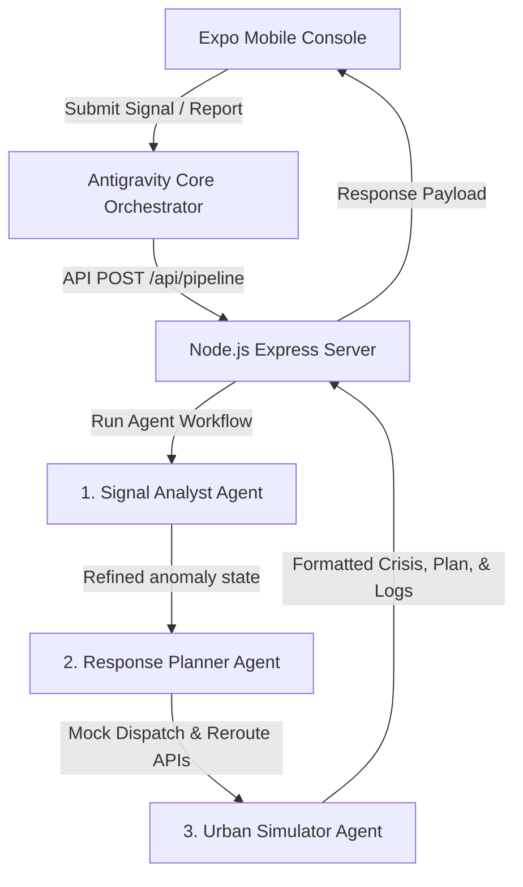

# CIRO 🌌 Metropolitan Crisis Intelligence & Response Console

<div align="center">

[](#)
[](#)
[](#)
[](#)
[](#)
[](#)
[](#)

</div>

---

## 🌌 What is CIRO?

**CIRO** (Crisis Intelligence & Response Orchestrator) is a state-of-the-art metropolitan emergency coordination platform designed for modern civic dispatchers. Powering the system is the **Antigravity Core 🌌**, a multi-agent AI pipeline that ingests noisy real-world feeds, parses anomalies, structures incident plans, and validates them against metropolitan traffic and weather graphs.

Designed with premium, rich dark aesthetics, HSL Tailored color variables, and smooth micro-animations, CIRO bridges the gap between field incidents and live metropolitan dispatch networks.

---

## 🚀 Features at a Glance

* **Interactive Crisis Map**: Live vector map showing active metropolitan incidents categorized by urgency level with dynamic route alterations.
* **Intake Form**: Interactive multi-step report flow that normalizes raw English, Urdu, or Roman Urdu feeds into strongly-typed emergency incidents.
* **Reasoning Sheet Trace Feed**: Dispatchers can watch the step-by-step reasoning steps of the **Antigravity Core** pipeline executing.
* **Multi-Agent Simulation**: Automatically models response times, dispatched assets, and congestion reduction percentage before sending responders into the field.

---

## 🏛️ System Architecture

The application is structured around a full-stack architecture divided into a server-centric backend and a React Native frontend console.



---

## 🛠️ Technology Stack

### Backend Server (`/server`)
* **Core**: Node.js, TypeScript, Express.js
* **LLM Engine**: Google Generative AI (Gemini 2.5)
* **Auth & Session Security**: Firebase Admin SDK
* **State & Networking**: REST API endpoints mapping models directly to client stores.

### Mobile Client Console (`/`)
* **Framework**: React Native, Expo SDK 54, Expo Router
* **Visuals**: HSL custom palettes, Slate typography, Ionicons
* **State Management**: Zustand
* **Animations**: React Native Reanimated

---

## ⚙️ How to Set Up & Run the Project

Follow these instructions to start the backend server and Expo mobile console concurrently.

### 1. Prerequisites
Ensure you have the following installed on your machine:
* **Node.js** (v18 or higher)
* **npm** (v9 or higher)

---

### 2. Run the Node.js Express Server (`/server`)

The backend coordinates the multi-agent AI workflow.

1. Navigate to the server directory:
   ```bash
   cd server
   ```
2. Install the backend dependencies:
   ```bash
   npm install
   ```
3. Set up your environment variables:
   Create a `.env` file inside the `server/` directory and configure your credentials:
   ```env
   PORT=3000
   GEMINI_API_KEY=your_gemini_api_key_here
   # (Optional) For Firebase Auth Verification:
   GOOGLE_APPLICATION_CREDENTIALS=path/to/service-account.json
   ```
4. Start the server in development mode:
   ```bash
   npm run dev
   ```
   *The console will print `CIRO Server is running on port 3000` upon startup.*

---

### 3. Run the Expo Mobile Console (`/` Root)

The mobile console is optimized for cross-platform local development.

1. Navigate to the root directory:
   ```bash
   cd ..
   ```
2. Install the client dependencies:
   ```bash
   npm install
   ```
3. Start the Expo development server:
   ```bash
   npx expo start
   ```
4. **Choose your Target Platform**:
   * **Web browser**: Press `w` to open the visual console inside the browser (`http://localhost:8081`).
   * **Android Emulator**: Ensure your emulator is open, then press `a`.
   * **Physical Mobile Device**: Download the **Expo Go** app, and scan the QR code displayed in your terminal. *(Antigravity Core's dynamic host resolver will automatically detect and link to your laptop's local backend IP!)*

---

## 🤖 The Antigravity Multi-Agent Pipeline

When a crisis signal is pushed to the server, the following components work in sequence:

1. **Antigravity Core Ingestion**: Handled in `server/model.tsx`, this establishes a secure connection to the Express server and loads the dynamic progress step in the Reasoning Sheet.
2. **Signal Analyst Agent**: Ingests noisy reports, checks mock weather and congestion APIs, and assesses incident severity levels with raw JSON reasoning.
3. **Response Planner Agent**: Evaluates the analyst's output, selects emergency assets (rescue teams, fire trucks, ambulance units) to dispatch, and proposes map route modifications.
4. **Simulator Agent**: Validates routing changes against mock traffic graphs, estimates response time optimizations, and compiles a complete simulated timeline.
5. **Core Finalization**: Appends the successfully executed logs and maps the output back to the client Zustand stores to render real-time interactive maps, markers, and detail cards.
